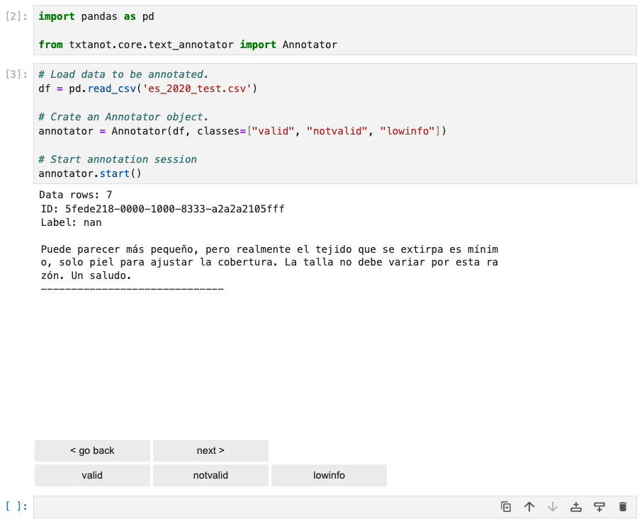
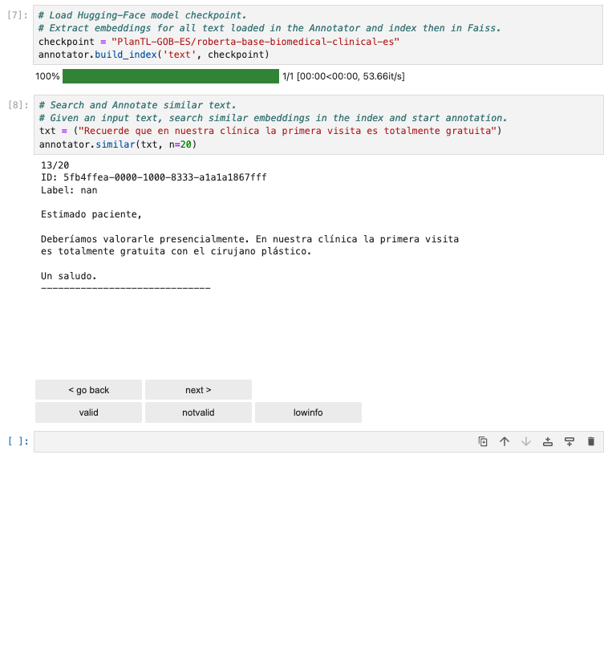

# txtanot

Text Annotator with Similarity engine. 

Jupyter notebook widget to annotate text.

## Features
- Displays a GUI (graphical user interface) in a cell of a Jupyter notebook and allows annotating text.
- Similarity engine. It is useful to collect data similar to one given item. Given a large dataset, while annotating we may find one relevant item and want to have more similar examples. Instead of going through all the data, we can focus on finding similar data points.
  - Extracts embeddings of the loaded dataset and builds an index.
  - It uses a Hugging Face model checkpoint to extract embeddings. The checkpoint to use is a parameter easily configurable.
  - It is optional. The widget can vbe used without similarity index.
- Multiple annotation classes.
- Handles data which has already being annotated. Option to filter annotated data and keep untouched.

## Annotation

## Similarity 

